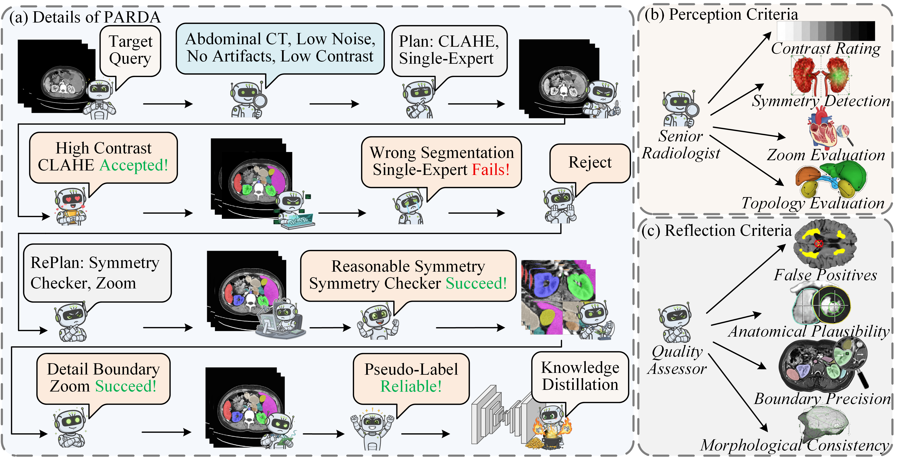

# PARDA: A Perceive-Act-Reflect-Distill Agent for Source-Free Unsupervised Domain Adaptation

Official implementation of **PARDA**, an agentic framework for Source-Free Unsupervised Domain Adaptation in medical image segmentation.



## Project Structure

```
PARDA/
├── Agent_Base.py             # Main entry point - MedicalSFUDAAgent orchestrator
├── Perception.py             #  Data analysis & planning module
├── Action.py                 #  Execution module 
├── Reflection.py             #  Quality control & iterative refinement
├── Knowledge_Distillation.py #  Knowledge Distillation
├── Toolbox.py                # Unified toolbox (BiomedParse, SAM3, CLAHE, etc.)
├── Prompts.py                # Metaprompt registry for VLM interactions
├── BiomedParse_inference.py  # Standalone multi-GPU BiomedParse script
├── run_sam3_standalone.py    # Standalone SAM3 script
├── nnUNet2BiomedParse.py     # Data format converter
├── Clean_Dataset.py          # Dataset cleanup utility
└── Clean_label.py            # Label cleanup utility
```

## Requirements

### External Dependencies

PARDA requires the following external models to be installed:

#### 1. BiomedParse

BiomedParse is used for text-guided medical image segmentation.

```bash
# Clone and setup BiomedParse
git clone https://github.com/microsoft/BiomedParse.git
cd BiomedParse
pip install -r requirements.txt
```

Set the path in your configuration:

```python
BiomedParse_DIR = "/path/to/BiomedParse"
biomedparse_ckpt = "/path/to/BiomedParse/biomedparse_v1.pt"
```

#### 2. SAM3

SAM3 provides 3D-aware segmentation with boundary refinement.

```bash
# Clone and setup SAM3
git clone https://github.com/facebookresearch/sam3.git
cd sam3
pip install -e .


pip install -e ".[notebooks]"
pip install -e ".[train,dev]"
```

Set the path in your configuration:

```python
SAM3_DIR = "/path/to/sam3"
sam3_ckpt = "/path/to/sam3/sam3.pt"
```

**Note**: SAM3 runs in a separate conda environment. Update the Python path in `Action.py`:

```python
SAM3_PYTHON_PATH = "/path/to/miniconda3/envs/sam3/bin/python"
```

#### 3. nnUNet

nnUNet is used for the final knowledge distillation phase.

```bash
pip install nnunetv2
```

Set environment variables:

```bash
export nnUNet_raw="/path/to/nnUNet_raw"
export nnUNet_preprocessed="/path/to/nnUNet_preprocessed"
export nnUNet_results="/path/to/nnUNet_results"
```

## Checkpoints

Download the following checkpoints:

| Model       | Huggingface Link                                             | Default Path     |
| ----------- | ------------------------------------------------------------ | ---------------- |
| BiomedParse | [Microsoft BiomedParse](https://huggingface.co/microsoft/BiomedParse) | `biomedparse.pt` |
| SAM3        | [SAM3 Repository](https://huggingface.co/facebook/sam3)      | `sam3.pt`        |

## Usage

### Basic Usage

```python
from Agent_Base import MedicalSFUDAAgent

# Configuration
API_KEY = "your-api-key"
BASE_URL = "https://api.openai.com/v1"  # or compatible API endpoint
TARGET_DATA = "/path/to/nnUNet_raw/DatasetXXX_YourData"
TARGETS_QUERY = "Liver,Right Kidney,Left Kidney,Spleen"

# Initialize agent
agent = MedicalSFUDAAgent(
    target_organs=TARGETS,
    target_data_path=TARGET_DATA,
    result_dir="/path/to/results",
    api_key=API_KEY,
    base_url=BASE_URL,
    biomedparse_ckpt="/path/to/biomedparse.ckpt",
    sam3_ckpt="/path/to/sam3.pt",
    gpus=[0, 1]
)

# Run full pipeline
agent.run(
    run_inference=True,
    run_reflection=True,
    run_finetuning=True
)
```

### Workflow Control

You can control which phases to execute:

```python
# Only run perception and action (no reflection/finetuning)
agent.run(run_inference=True, run_reflection=False, run_finetuning=False)

# Skip inference, only run finetuning (if pseudo-labels already exist)
agent.run(run_inference=False, run_reflection=False, run_finetuning=True)
```

## Meta-prompts

PARDA uses main meta-prompts defined in `Prompts.py`:

### PERCEPTION_ANALYSIS

Used during perception for domain analysis:

- Corrects spelling errors in target organ names
- Analyzes image characteristics (contrast, noise, artifacts)
- Recommends primary segmentation tool
- Configures preprocessing (CLAHE) parameters

### REFLECTION_CRITIC

Used during reflection for quality assessment:

- Evaluates anatomical plausibility
- Checks boundary precision
- Identifies false positives
- Suggests remediation tools for rejected cases

## Toolbox Components

| Tool                   | Description                                      |
| ---------------------- | ------------------------------------------------ |
| `BiomedParsePredictor` | Text-guided segmentation using BiomedParse       |
| `SAM3Wrapper`          | 3D segmentation with SAM3                        |
| `ZoomSAM3Refiner`      | Zoomed refinement for small structures           |
| `CLAHE`                | Contrast-limited adaptive histogram equalization |
| `TopologyCleaner`      | Removes fragmented predictions                   |
| `SymmetryChecker`      | Validates paired organ symmetry                  |
| `ZoomROITool`          | ROI extraction for small targets                 |

## Data Format

PARDA expects data in nnUNet format:

```
DatasetXXX_Name/
├── imagesTr/
│   ├── case_0000.nii.gz
│   ├── case_0001.nii.gz
│   └── ...
├── labelsTr/           # Optional (for evaluation)
│   ├── case.nii.gz
│   └── ...
└── dataset.json
```

## Output

The agent produces:

- **Adaptation Plan**: JSON file with domain analysis and strategy
- **Adapted Models** : nnUNet format adapted models
- **Pseudo-labels**: Generated segmentation masks in nnUNet format
- **Reflection Results**: Quality assessment for each case
- **Logs**: Detailed execution logs

```
result_dir/
├── logs/
│   └── agent_run_YYYYMMDD_HHMMSS.log
├── adaptation_plan_YYYYMMDD_HHMMSS.json
└── DatasetXXX_Adapted/
    ├── imagesTr/
    ├── labelsTr/
    └── dataset.json
```

## Citation

If you find this work useful, please cite:

```bibtex

```

## License

This project is licensed under the MIT License.

## Acknowledgements

This work builds upon:

- [BiomedParse](https://github.com/microsoft/BiomedParse) - Microsoft's biomedical image parsing model

  ```latex
  @article{zhao2025foundation,
    title={A foundation model for joint segmentation, detection and recognition of biomedical objects across nine modalities},
    author={Zhao, Theodore and Gu, Yu and Yang, Jianwei and Usuyama, Naoto and Lee, Ho Hin and Kiblawi, Sid and Naumann, Tristan and Gao, Jianfeng and Crabtree, Angela and Abel, Jacob and others},
    journal={Nature methods},
    volume={22},
    number={1},
    pages={166--176},
    year={2025},
    publisher={Nature Publishing Group US New York}
  }
  ```

- [SAM3](https://github.com/facebookresearch/sam3) - Segment Anything Model 3

  ```latex
  @misc{carion2025sam3segmentconcepts,
        title={SAM 3: Segment Anything with Concepts},
        author={Nicolas Carion and Laura Gustafson and Yuan-Ting Hu and Shoubhik Debnath and Ronghang Hu and Didac Suris and Chaitanya Ryali and Kalyan Vasudev Alwala and Haitham Khedr and Andrew Huang and Jie Lei and Tengyu Ma and Baishan Guo and Arpit Kalla and Markus Marks and Joseph Greer and Meng Wang and Peize Sun and Roman Rädle and Triantafyllos Afouras and Effrosyni Mavroudi and Katherine Xu and Tsung-Han Wu and Yu Zhou and Liliane Momeni and Rishi Hazra and Shuangrui Ding and Sagar Vaze and Francois Porcher and Feng Li and Siyuan Li and Aishwarya Kamath and Ho Kei Cheng and Piotr Dollár and Nikhila Ravi and Kate Saenko and Pengchuan Zhang and Christoph Feichtenhofer},
        year={2025},
        eprint={2511.16719},
        archivePrefix={arXiv},
        primaryClass={cs.CV},
        url={https://arxiv.org/abs/2511.16719},
  }
  ```

- [nnUNet](https://github.com/MIC-DKFZ/nnUNet) - Self-configuring framework for medical image segmentation

  ```
  @article{nnunet,
    title={nnU-Net: a self-configuring method for deep learning-based biomedical image segmentation},
    author={Fabian Isensee and Paul F. Jaeger and Simon A. A. Kohl and Jens Petersen and Klaus Hermann Maier-Hein},
    journal={Nature Methods},
    year={2020},
    volume={18},
    pages={203 - 211}
  }
  ```

  